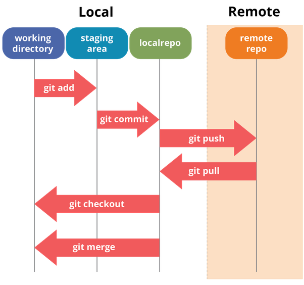

# Git basic
### 1. Git and how it works
 
 **Remote**: This is the Git server side where the project’s source code is stored. 
 **Local**: This is the client side (your computer) where the source code is cloned from the remote repository.  
+ **git add**: Command to move files from "Working directory" to "Staging area".
+ **git commit**: The command to move files from the "Staging Area" to the "Repository."
+ **git checkout**: The command to switch to a different branch in the "Repository" (each repository can have multiple branches).
+ **git merge**: The command to merge code from one branch to another.
+ **git push**: The command to push code from the Local "Repository" to the Remote "Repository."
+ **git pull**: The command to fetch code from the Remote "Repository" to the Local "Repository." 
### 2. Các thao tác cơ bản
#### Tạo một kho lưu trữ - git init
#### Kiểm tra trạng thái - git status
#### git add 
+  Di chuyển 1 file có sự thay đổi tới Staging Area  
`$ git add hello.txt`
+  Thêm tất cả thay đổi trong thư mục. 
`$ git add -A` hoặc `$ git add .`
#### git commit - di chuyển files từ Staging Area tới vùng Local Repository
+ Ví dụ commit việc thêm file hello.txt vào dự án 
`$ git commit -m "Create hello.txt"` 
**-m** viết tắt của "message", tức là thông điệp của commit này nói lên điều gì.
### 3. Kho lưu trữ từ xa (remote repository)
Để tạo ra một remote repository ta đăng nhập một trong các bên cung cấp máy chủ Git như github, gitlab, v.v. Sau đó vào repository của bạn, chọn **Clone -> Clone with SSH -> Copy URL**
+ Thêm remote repository vào cài đặt phía local 
`$ git remote add origin git@.../myrepo.git`  
Lệnh trên sẽ thêm remote repository vào file cấu hình phía local tại my_project/.git/config.
#### Tải lên máy chủ - git push
Theo mặc định khi tạo mới repository (git init) sẽ có một nhánh (branch) tên là "main".  Vì vậy chúng ta có thể đẩy (push) nhánh "main" tại local lên remote ngay bây giờ với lệnh : 
`git push origin main`
#### Lấy các thay đổi từ máy chủ - git pull
Chạy `git pull origin main` để lấy các thay đổi từ nhánh "main" trên remote về nhánh "main" trên local.
### 4. Nhánh và thao tác với nhánh
 
#### Nhánh - branch
Mặc định sau khi tạo mới một repository với lệnh git init sẽ có một nhánh "main" được tạo ra.
#### Tạo mới một nhánh - git branch
Trong thực tế chúng ta thường tạo thêm branch develop, đây là branch được sử dụng với mục đích phát triển. Toàn bộ members trong dự án sẽ xây dựng các chức năng từ nhánh này. 
`$ git branch develop`
#### Chuyển nhánh - git checkout
Xem các branch đang có trên local và bạn đang ở branch nào, dấu sao (*) trước tên branch thể hiện bạn đang ở branch đó.
`$ git branch` 
`  develop` 
`* main` 
Chuyển tới nhánh develop
`$ git checkout develop` 
Chúng ta đã được chuyển sang branch develop. Giả sử bạn nhận được yêu cầu là xây dựng chức năng authentication và phải tạo branch mới, branch mới cần checkout ra từ branch develop thì ta làm như sau.
`$ git checkout -b feature/authen` 
feature/authen branch vừa được tạo ra, trường hợp này code của feature/authen giống hệt với develop branch. 
**Chú ý**: Điểm khác biệt khi tạo branch mới với `git branch [branch_name]` và `git checkout -b [branch_name]` là:
+ Với git branch sẽ tạo branch mới từ master branch và chỉ tạo branch mới chứ không chuyển luôn sang branch mới.
+ Với git checkout -b sẽ tạo branch mới từ branch hiện tại và đồng thời chuyển sang branch mới.
#### Hợp nhất branch - git merge
Để hợp nhất các thay đổi từ bên branch feature/authen sang branch main. 
+ Di chuyển về nhánh main: `$ git checkout main`
+ Hợp nhất: `$ git merge feature/authen`
#### Xóa một nhánh
Sau khi hợp nhất nhánh feature/authen vào master thì có thể xóa nó đi vì không cần thiết nữa. Để xóa một branch ta sử dụng lệnh git branch -d [branch_name]. 
`$ git branch -D feature/authen`